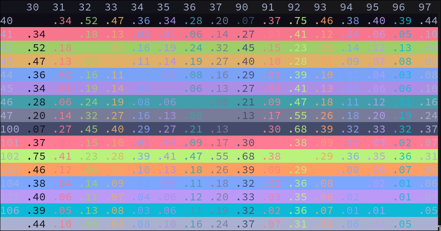
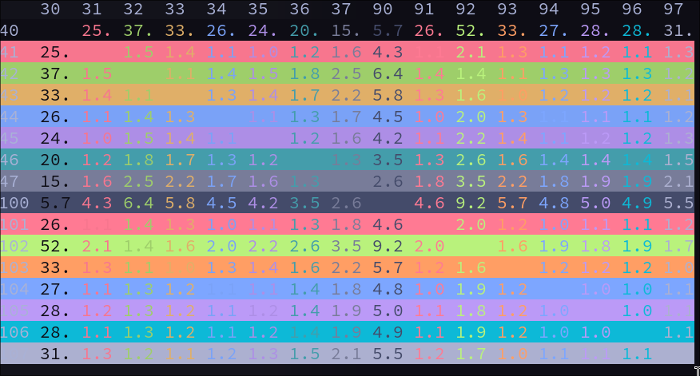
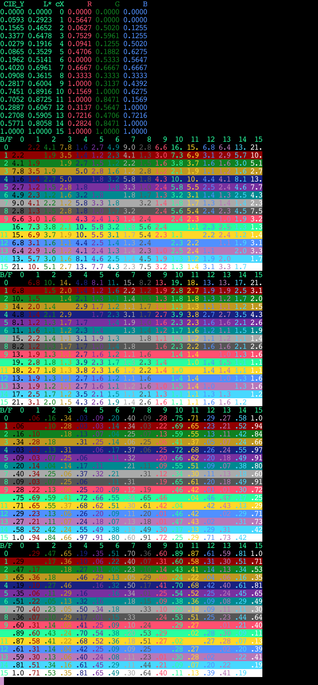

# Contrast Experiments

Tattoy is currently using the [WCAG contrast algorithm provided by the palette crate](https://docs.rs/palette/latest/palette/color_difference/trait.Wcag21RelativeContrast.html). But as @c-blake has rightly pointed out, this doesn't take into account the ratio of visible background pixels to foreground pixels. For example the contrast required for a single fullstop character, ".", is goting to be diffrent from a capital, "B".

Here we can experiment with various ways to calculate optimal contrasts.

## contrastDiff.py

## contrastRat.py

## contrastRat.py

Counter-examples of `ScoreA > ScoreB` => A Easier to Read than B (by subjective
perception) is evidence against utility of any score measuring legibility.

I find pretty bad counter-examples to all 4 proposed formulae.  A more thorough
way to rank proposals would be to systematically go through all 1024 cases and
count "inversions".  I didn't have the patience to do that, mostly just thinking
"none are perfect/great", but I like the "difference" ones better than "ratio"
because there is no fudge term/factor pulled form thin air seemingly in defiance
of the primary research trying to get a linear lightness scales.

Anyway, here are counter examples according to my eyeballs/brain.  My notation
is score@rowColorNum,columnColorNum, e.g. 1.6@0,4 = score1.6, black bg, blue fg
for the first table.

 - First Table:  .05,RY

   + 1.6@0,4 harder to read than 1.4@7,9 & marginally harder than inverse (9,7)

   + 1.2@3,9 seems easier than 1.6@0,4

 - Second Table: .05,RL

   + 4.8@0,4 seems harder to read than MANY lesser scored cells - literally
     half the table.  Probably this means minL=.05 is a horrible choice for
     L* value ranges.  Given that it was clearly "just some round number near
     but below the lightness score of 4", this *really* begs the question of
     setting minL more systematically.

   + To side-step doing all that, but still evaluate the score, just consider
     the 4x4 sub-matrix (6789,6789) where all the L* values.  I still see the
     metric fail in that 1.6@9,8 seems harder to read than 1.3@6,7 *or* 7,6.
     Admittedly, this one may just relate to the fact that the matrix should
     not really be a symmetric matrix since pixel area varies across polarity
     so much in most fonts.

 - Third Table: DY

   + .03@0,4 harder to read than .01@4,9

   + slew of same-scored 0.11 with wildly different legibility.

   + .13 @14,11 way worse than either 6,5 or 5,6 (cyan purple)

 - Fourth Table: DL

   + .16@5,6 easier than .19@0,4

   + .09@9,6 not so bad either.
